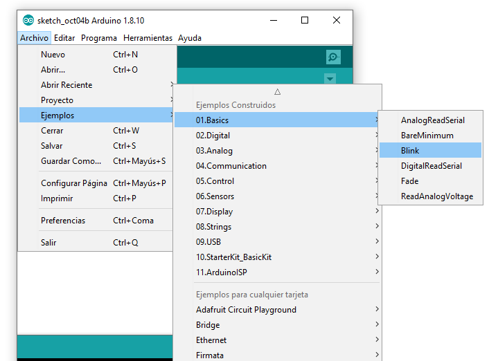
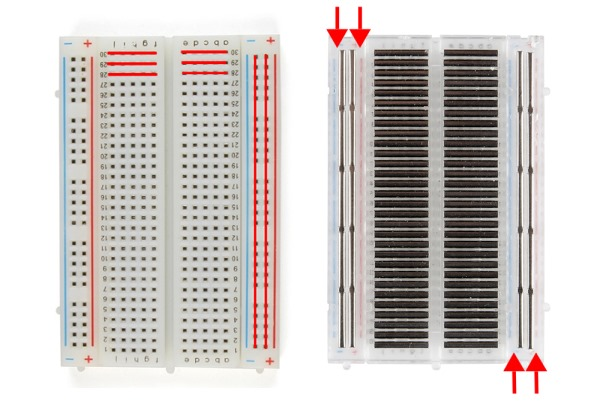

# Como Empezar

1. Windows/OSX: Instalar [drivers de USB CH340G](drivers/) (Linux vienen por defecto)
2. Instalar [Arduino IDE](https://www.arduino.cc/en/main/software)
3. Conectar el Arduino por USB
3. Ir a Fichero > Ejemplos > Basics > Blink
4. 'Subir' codigo al Arduino

# Herramientas: Arduino Nano

# Herramientas: Placa

La placa se usa para conectar el arduino con diferentes componentes. 

Basicamente hace que se puedan crear varias conexiones en cada uno de los pines.

# Primer Circuito: Blink

1. Conectar LED al pin D13: *PATA LARGA* es *POSITIVO* y va hacia el ARDUINO
2. La pata larga del LED se conecta con el *NEGATIVO* y as su vez, con el pin GND (Groud = Tierra = Negativo).
3. Se puede usar una resistencia de 330 Ohm en el LED D13 pero es opcional, ya que el Arduino ya lleva una internamente

